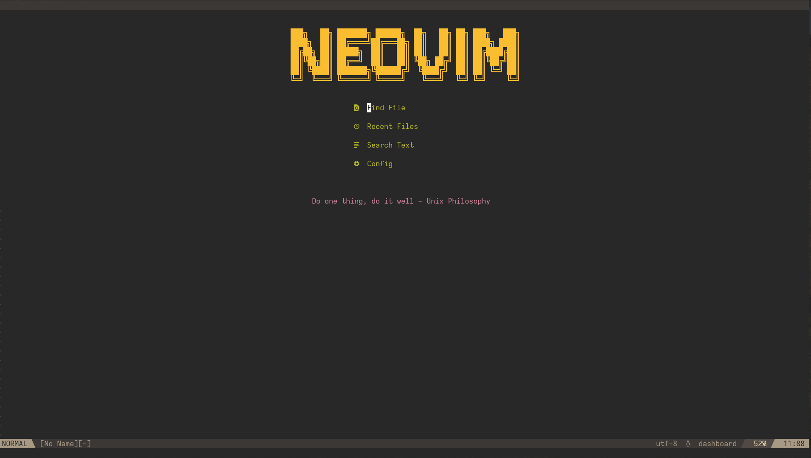

# nvim-lua



This configuation is done using LSP in lua.
I have another coonfiguration using coc both work really well.
It's configured for the following languages:

1. Python
2. C
3. cpp
4. html,css,javascrip.
   This config offers:
5. Autocompletion
6. CodeFormatting and many more

# Quick Intstallation

Before cloning the repo you need to install nodejs and npm with the following command in arch linux:

```bash
sudo pacman -S nodejs npm
```

### Prettier:

for prettier to work you need to install it by running this command.

```bash
npm install --save-dev prettier prettier-plugin-solidity
```

- Note the above command my not work sometime if that the case for you then go to
  prettier documentation you will find more information about it.

1. You need a plugin manager so for this I am using packer which is grade if you're on linux just copy and paste this command:
   ```bash
   git clone --depth 1 https://github.com/wbthomason/packer.nvim\
    ~/.local/share/nvim/site/pack/packer/start/packer.nvim
   ```
2. After this clone this repo to under your ~.config file.
   ```bash
   git clone https://github.com/abdoulayegk/nvim-lua.git
   ```
3. Rename the nvim-lua folder to be nvim.
   ```bash
   mv nvim-lua nvim
   ```
4. Open nvim and run this command

```bash
:PackerSync
```

#### if you get any error then you can run this command:

```bash
pip3 install neovim
```

In case you run into any issues you can run the following command inside nvim <br>

```bash
:checkhealth
```

To make sure that the formatting is working fine for c and
!!boom you're good to go.<br>
!!! Enjoy neovim
